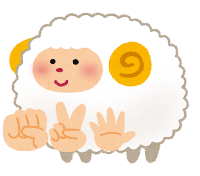

# jankensheep

[](https://pkg.go.dev/github.com/genkami/jankensheep)




Rock-paper-scissors game library

# Examples

Play with two players:

```go
	myHand := jankensheep.Paper
	opponentsHand := jankensheep.Rock
	if myHand.Beats(opponentsHand) {
		fmt.Println("win")
	}
	// Output: win
```

Play with multiple players:
```go
	players := []string{"Watame", "Miko", "Roboco"}
	signs := []jankensheep.Sign{jankensheep.Rock, jankensheep.Scissors, jankensheep.Rock}
	winners := jankensheep.Play(signs)
	fmt.Println("Winners:")
	for _, i := range winners {
		fmt.Println(players[i])
	}
	// Output: Winners:
	// Watame
	// Roboco
```